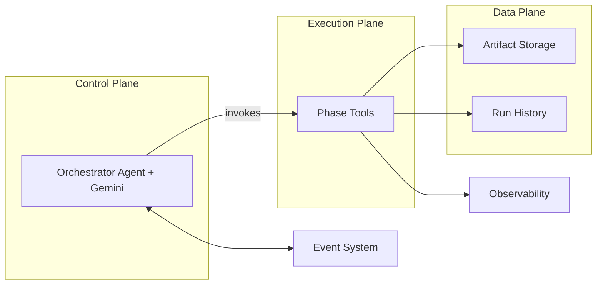
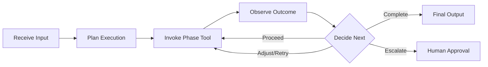
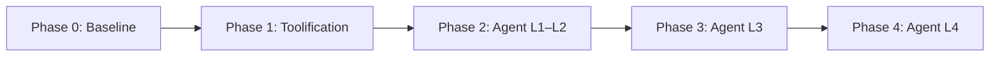

# Agentic Orchestrator Whitepaper

## Single-Agent Design

**Version 1.1 | December 2025**

---

## Contents

- [1. Executive Summary](#1-executive-summary)
- [2. Problem Landscape](#2-problem-landscape)
- [3. Vision and Guiding Principles](#3-vision-and-guiding-principles)
- [4. Conceptual Architecture](#4-conceptual-architecture)
- [5. Agent Roles and Responsibilities](#5-agent-roles-and-responsibilities)
- [6. End-to-End Flow](#6-end-to-end-flow)
- [7. Capability Levels](#7-capability-levels)
- [8. Implementation Roadmap](#8-implementation-roadmap)
- [9. Business and Technical Impact](#9-business-and-technical-impact)
- [10. Governance](#10-governance)
- [11. Conclusion](#11-conclusion)

---

# 1. Executive Summary

Enterprise data pipelines today run on static, deterministic logic. When failures occur, humans must intervene. This whitepaper proposes transforming an existing pipeline orchestrator into a **single Orchestrator Agent** on Google Cloud Platform using Gemini and the Agent Development Kit (ADK). The agent treats each pipeline phase as a callable tool, reasoning through a **Think → Act → Observe** loop to drive adaptive execution. This approach reduces manual intervention, improves reliability, and establishes a foundation for self-evolving automation. A phased roadmap enables incremental adoption over 8–12 months, progressing from baseline instrumentation through full agentic capability with human oversight preserved throughout.

---

# 2. Problem Landscape

Modern data processing pipelines face a fundamental tension: they must be reliable enough for production workloads yet flexible enough to handle unexpected conditions.

**Static orchestration** addresses reliability through deterministic execution—if a phase fails, the pipeline halts. This fail-fast approach prevents cascading errors but creates operational friction:

- **Manual Recovery**: Recoverable failures require human-initiated re-runs
- **No Adaptive Learning**: Historical patterns are not leveraged for optimization
- **Rigid Thresholds**: Static configurations cannot adjust to changing data characteristics
- **Reactive Posture**: Issues are addressed after failure, not prevented proactively

The result is high operational overhead, slower cycle times, and underutilized automation potential.

The opportunity lies in introducing **reasoning capability** into orchestration—enabling the system to interpret context, adapt to conditions, and improve over time while maintaining predictability and human oversight.

---

# 3. Vision and Guiding Principles

## Vision

Transform the pipeline orchestrator from a static automation system into an **intelligent, single-agent orchestrator** that reasons about execution, adapts to conditions, and continuously improves—while preserving human control and full auditability.

The target state is an Orchestrator Agent powered by Gemini, hosted on GCP via ADK, that treats pipeline phases as callable tools and operates through a reasoning loop.

## Guiding Principles

| Principle | Description |
|-----------|-------------|
| **Autonomy** | The agent executes end-to-end without constant human direction, intervening only when guardrails require escalation |
| **Adaptation** | The agent adjusts behavior based on observed outcomes, implementing intelligent retry and conditional branching |
| **Auditability** | Every decision is logged with reasoning, enabling full traceability and compliance |
| **Explainability** | Agent actions can be understood and justified; no opaque decision-making |
| **Unified Context** | A single agent maintains holistic awareness across all phases, avoiding fragmented state |
| **Safety & Guardrails** | Human approval gates, retry limits, and thresholds ensure predictable, controlled behavior |

---

# 4. Conceptual Architecture

The architecture organizes into three planes, with the Orchestrator Agent at the center.

## Control Plane

The **Orchestrator Agent** runs within an ADK application, using Gemini as its reasoning engine. It maintains context, plans execution, invokes tools, and interprets results through a continuous **Think → Act → Observe** loop.

- **Think**: Assess current state, logs, and metrics; determine the next action
- **Act**: Invoke the appropriate phase tool with required parameters
- **Observe**: Read outputs, update state, log the decision and outcome

## Execution Plane

**Phase Tools** run as isolated, stateless services. Each tool performs a single function—Extract, Validate, Analyze, Transform, or Build—and returns structured results to the agent.

## Data Plane

**Storage and History** services persist artifacts and run records. The agent uses short-term context (current run state) and long-term context (historical patterns) to inform decisions.

**Event and Observability** services handle triggers, notifications, and monitoring across all planes.

---

# 5. Agent Roles and Responsibilities

The single-agent architecture defines clear roles for each component.

## Role Summary

| Role | Responsibility | Characteristics |
|------|----------------|-----------------|
| **Orchestrator Agent** | Central decision-maker; plans execution, invokes tools, interprets results, manages context | Stateful, reasoning-enabled, runs Think→Act→Observe loop |
| **Phase Tools** | Execute discrete pipeline functions (Extract, Validate, Analyze, Transform, Build) | Stateless, isolated, return structured outputs |
| **Observability Layer** | Captures logs, metrics, traces; enables monitoring and debugging | Passive, continuous, spans all components |
| **Human Approval Actor** | Reviews and approves agent decisions when guardrails trigger escalation | External, asynchronous, authoritative |
| **GCP Infrastructure** | Provides runtime (Cloud Run), storage (GCS, BigQuery), messaging (Pub/Sub), and AI (Vertex AI) | Managed services, scalable, integrated |

## Interaction Model

The Orchestrator Agent is the sole decision-maker. Tools are passive executors that perform work and return results. Humans intervene only at defined approval gates. Infrastructure services provide the underlying platform without influencing agent logic.

---

# 6. End-to-End Flow

The agent drives pipeline execution through a conceptual flow that remains consistent regardless of which phases are invoked.

## Flow Steps

1. **Receive Input**: A trigger (event or request) initiates a pipeline run with an input snapshot
2. **Plan Execution**: The agent assesses context and determines the initial phase sequence
3. **Invoke Phase Tool**: The agent calls the appropriate tool, passing required parameters
4. **Observe Outcome**: The agent reads tool outputs, logs, and status
5. **Decide Next Action**: Based on results, the agent proceeds, retries, adjusts, or escalates
6. **Complete or Escalate**: The flow concludes with final outputs or pauses for human approval

This loop repeats until all phases complete, a fatal error occurs, or human intervention is required.

---

# 7. Capability Levels

The Orchestrator Agent matures through four capability levels, each building on the previous.

**Level 1 — Connected Problem Solver**
The agent invokes tools in sequence, interprets results, and reports status. Behavior is deterministic; no adaptation occurs. This level establishes agent-based execution as a foundation.

**Level 2 — Strategic Problem Solver**
The agent adapts based on outcomes. It implements intelligent retry, adjusts parameters on failure, and conditionally branches. For example, if validation fails due to encoding, the agent retries with detection enabled.

**Level 3 — Collaborative Orchestrator**
The agent coordinates with humans and external systems. It pauses for approval when thresholds are breached, triggers downstream workflows, and routes errors to appropriate responders.

**Level 4 — Self-Evolving System**
The agent analyzes historical patterns, proposes threshold adjustments, and suggests playbook modifications—always with human approval before changes take effect. This enables continuous improvement of orchestration itself.

---

# 8. Implementation Roadmap

The transformation proceeds through five phases over approximately 8–12 months.

**Phase 0 — Baseline (4 weeks)**
Document current architecture, instrument observability, establish success metrics.

**Phase 1 — Toolification (6 weeks)**
Wrap pipeline phases as callable ADK tools; containerize and deploy to Cloud Run.

**Phase 2 — Agent L1–L2 (8 weeks)**
Deploy Orchestrator Agent with Gemini; implement Think→Act→Observe loop and adaptive retry.

**Phase 3 — Agent L3 (6 weeks)**
Add approval gates, cross-pipeline coordination, and notification integration.

**Phase 4 — Agent L4 (8 weeks)**
Enable pattern analysis, threshold tuning proposals, and human-approved playbook evolution.

Each phase delivers incremental value while building toward full agentic capability.

---

# 9. Business and Technical Impact

## Operational Efficiency

- **Reduced Manual Intervention**: Intelligent retry and adaptive planning minimize human-initiated re-runs
- **Faster Resolution**: Context-aware error handling reduces mean time to recovery
- **Higher Throughput**: More runs succeed on first pass, increasing overall capacity

## Cost Optimization

- **Engineer Leverage**: Reduced operational burden frees capacity for higher-value work
- **Compute Efficiency**: Smart retry avoids unnecessary full re-runs
- **Right-Sizing**: Agent-driven decisions optimize resource utilization

## Reliability and Compliance

- **Higher First-Pass Success**: Adaptive behavior increases successful completions
- **Full Auditability**: Every decision logged with reasoning chain
- **Approval Tracking**: Human-in-the-loop decisions recorded with timestamp and approver

## Strategic Value

- **Modernization Velocity**: Faster, more reliable pipelines accelerate migration timelines
- **Platform Foundation**: Agentic patterns extend to other enterprise workflows

---

# 10. Governance

Agentic systems require clear governance to ensure predictable, controlled behavior.

## Human Oversight

The Orchestrator Agent operates within defined guardrails. When thresholds are breached—success rates fall below acceptable levels, retries are exhausted, or outcomes fall outside expected ranges—the agent pauses and escalates to human approvers. No autonomous action proceeds without explicit approval in these scenarios.

## Auditability and Transparency

Every agent decision is logged with full context: what was observed, what was decided, why, and what action was taken. This enables post-hoc review, compliance verification, and continuous improvement of agent behavior.

## Change Control

At Level 4, the agent may propose modifications to thresholds, retry strategies, or playbooks. All such proposals require human approval before implementation. The agent recommends; humans authorize.

## Accountability

The single-agent design ensures clear accountability. One agent makes decisions; humans retain ultimate authority. There is no ambiguity about which component is responsible for any given action.

---

# 11. Conclusion

This whitepaper presents an approach for evolving an existing pipeline orchestrator into a single-agent agentic system on GCP. The transformation reframes pipeline phases as tools invoked by an intelligent Orchestrator Agent powered by Gemini and hosted via ADK.

The single-agent design maintains unified context and clear accountability while enabling increasingly sophisticated behaviors—from basic tool invocation through adaptive planning, human-in-the-loop coordination, and self-evolving optimization.

The phased roadmap provides a practical path from current state to full agentic capability, with each phase delivering incremental value. For organizations managing complex data pipelines, this approach offers reduced manual effort, improved reliability, and faster modernization—while preserving the control and auditability required for enterprise operations.

---

**Document Information**

- **Title**: Agentic Orchestrator Whitepaper — Google ADK + GCP Baseline (Single-Agent Design)
- **Version**: 1.1
- **Date**: December 2025
- **Classification**: Internal

**Prepared For**: CTO / Head of AI Strategy / Modernization Leaders

**Document Type**: High-level architectural approach whitepaper. This document does not define implementation details, deployment configurations, or technical specifications.
