# Agentic Modernization: Transforming Legacy Systems Through Governed Decision Orchestration

---

## Executive Summary

70% of digital transformations fail¹ to meet objectives. The reason: current tools automate code conversion but not the expert decision-making that determines migration success.

Only 24,000 COBOL programmers remain in the United States², with 10% retiring annually³. They support 220 billion lines of COBOL code⁴ processing $3 trillion in daily commerce⁵. As expertise retires, undocumented decision-making disappears. Bank of New York Mellon manages 343 million lines across 112,500 programs⁶, with leadership warning that "business knowledge" embedded in decades-old code will "walk out the door" with retiring developers.

Federal mandates⁷ (MGT Act, FITARA, 21st Century IDEA) accelerate modernization timelines, but the core challenge remains: capturing expert decision-making before it retires.

Agentic modernization captures decision patterns into auditable, repeatable loops that any team can execute with confidence. Research shows AI-assisted development achieves 20-30% faster development cycles with 20-25% fewer defects⁸.

**Thesis:** Agentic modernization transforms subjective decisions into auditable, phase-gated loops that reduce risk while accelerating complex migrations.

---

## 1. The Modernization Crisis

### The Talent Shortage

Only 24,000 COBOL programmers remain active in the United States², supporting 220 billion lines of code⁴ that process $3 trillion in daily commerce⁵. The workforce is aging rapidly:

- Average age: 45-55 years²
- 10% retiring annually³
- 46% of IT professionals notice COBOL developer shortage⁹
- Salaries: $100K-$150K+¹⁰ yet positions remain unfilled

Bank of New York Mellon manages 343 million lines of COBOL code across 112,500 programs⁶. Leadership warns that "business knowledge" embedded in decades-old code will "walk out the door" with retiring developers. This pattern is widespread: 92% of business decision-makers consider COBOL applications strategically critical¹¹.

### Why Current Approaches Fail

BCG research shows 70% of digital transformation initiatives fall short of objectives¹. Current methodologies automate code conversion but not critical decision-making. The result: projects appear nearly complete but stall for months, budgets multiply, migrations abandoned mid-flight.

**The gap:** Tools automate syntax translation (COBOL→Java, hierarchical→relational) but leave the hardest problems—dependency resolution, risk assessment, migration sequencing—to human judgment exercised under time pressure.

### The Microservices Transformation Challenge

Traditional refactoring approaches produce modernized code, but refactoring to services ≠ microservices architecture. Organizations face an additional transformation layer when moving from refactored monoliths to true microservices:

**Key challenges:**
- **Service Decomposition:** Identifying bounded contexts and service boundaries requires deep domain knowledge beyond code structure
- **API Design:** Creating clean, versioned service interfaces with proper contracts
- **Data Management:** Handling data consistency across services (eventual consistency, sagas, distributed transactions)
- **Infrastructure Requirements:** Containerization, service mesh, API gateways, distributed monitoring
- **Organizational Changes:** Team restructuring, DevOps practices, ownership models

Current refactoring models produce "better monoliths" or "coarse-grained services" that still require significant architectural transformation to achieve true microservices benefits. This additional complexity must be planned and governed from the start.

---

## 2. The Solution: Agentic Decision Orchestration

### What "Agentic" Means

A **governed control loop** that plans and executes work across **Baseline → Standardize → Assess → Transform → Build**, constrained by **explicit decision rights, evidence requirements, and human approval gates**.

**How it differs:**
- **vs Automation:** Chooses among approved actions and adapts; automation stops on exceptions
- **vs Copilots:** Owns phase-gate recommendations and packages evidence; copilots assist but don't own readiness

**What it does NOT mean:** Unlimited autonomy. Authority is bounded to reversible actions with mandatory human approval for scope changes, policy boundaries, or incomplete verification.

**Operationally:** The system produces consistent artifacts at every gate: what it observed, what it did, what changed, what failed, what risks were discovered, and what decision it recommends next (Go/No-go/Retry/Escalate).

### Decision Rights Model

Humans approve each gate; the agent **recommends** and, where permitted, **executes bounded actions**.

| Phase | Agent May | Human Must Approve |
|-------|-----------|-------------------|
| **Baseline** | Validate completeness, re-run acquisition | Scope, restricted data access |
| **Standardize** | Normalize, quarantine anomalies | Threshold exceptions, data-handling changes |
| **Assess** | Produce inventories, risk findings | Interpretations, readiness to proceed |
| **Transform** | Execute in approved increments | Behavior-affecting changes, exception acceptance |
| **Build** | Build, classify failures | Readiness beyond build, build-policy exceptions |

**Mandatory escalation:** Missing evidence, output changes exceeding tolerance, unexplainable retries, policy boundary approaches.

### Governance Inputs

Every modernization run requires three governance inputs:

**1. Risk Posture**
- Conservative (regulated/high-impact): Smaller increments, higher evidence thresholds, stricter exception policies
- Aggressive (low-risk with strong testability): Larger increments, more automated retries

**2. Constraints:** Security boundaries, compliance requirements, technical constraints, business constraints

**3. Target Intent:**
- Refactor-in-place (preserve structure, modernize syntax/platform)
- Refactor to services (decompose monolith into bounded contexts)
- **Refactor to microservices** (transform refactored code into true microservices architecture with service boundaries, API contracts, and distributed data management)
- Replatform (lift-and-shift with minimal code changes)
- Hybrid approach (different strategies per application tier)

---

## 3. The Five-Phase Modernization Loop

```mermaid
flowchart LR
    Start([Start]) --> P1[1. Baseline &<br/>Inventory]
    P1 --> G1{Human<br/>Gate}
    G1 -->|Approve| P2[2. Standardize &<br/>Validate]
    P2 --> G2{Human<br/>Gate}
    G2 -->|Approve| P3[3. Assess &<br/>De-risk]
    P3 --> G3{Human<br/>Gate}
    G3 -->|Approve| P4[4. Transform &<br/>Verify]
    P4 --> G4{Human<br/>Gate}
    G4 -->|Approve| P5[5. Build &<br/>Certify]
    P5 --> G5{Human<br/>Gate}
    G5 -->|Approve| End([Complete])
    
    G1 -.->|Retry/Escalate| P1
    G2 -.->|Retry/Escalate| P2
    G3 -.->|Retry/Escalate| P3
    G4 -.->|Retry/Escalate| P4
    G5 -.->|Retry/Escalate| P5
```

**Each phase produces evidence for human review and approval:**

1. **Baseline & Inventory** - Establish complete, authorized baseline and reconcile scope
2. **Standardize & Validate** - Ensure consistency and confirm completeness
3. **Assess & De-risk** - Understand dependencies, complexity, gaps, and risks; assess microservices readiness and identify service boundaries
4. **Transform & Verify** - Execute modernization in controlled increments with traceability; implement API design and service integration patterns for microservices targets
5. **Build & Certify** - Validate technical readiness (not functional equivalence)

**Operational changes:**
- Discovery produces inventory with automated complexity scoring
- Assessment generates migration patterns with confidence metrics and service boundary recommendations
- Design creates blueprints validated against stage gates, including API contracts for microservices
- Execution orchestrates migration with continuous validation
- Teams focus on exceptions; agents handle routine assessments
- Governance boards review aggregated metrics, not individual files

**Note:** Detailed phase specifications, pit-stop catalog, and technical controls available in separate Technical Implementation Guide.

---

## 4. Measurable Outcomes

### Key Performance Indicators

**Speed / Throughput**
- Phase Cycle Time: End-to-end duration per phase
- Application Throughput Rate: Apps progressing per time period
- Rework Ratio: Percentage requiring human correction

**Quality / Fidelity**
- Build Success Rate: Percentage that build without errors
- Functional Equivalence Score: Test cases passing (legacy vs modernized)
- Defect Escape Rate: Production defects per 1,000 lines
- Code Quality Index: Composite score from static analysis

**Risk / Governance**
- Human Approval Rate: Percentage approved without escalation
- Confidence Band Width: Statistical confidence interval
- Audit Trail Completeness: Percentage with full lineage

**Coverage / Completeness**
- Portfolio Coverage: Percentage of portfolio assessed
- Dependency Resolution Rate: Dependencies mapped to modern equivalents

**Microservices Readiness** (for microservices targets)
- Service Boundary Clarity: Percentage of well-defined service interfaces
- API Consistency: Versioning and documentation coverage
- Inter-Service Communication Efficiency: Latency and coupling metrics
- Data Consistency Achievement Rate: Successful distributed transaction patterns

**Cost / Efficiency**
- Effort Reduction Percentage: Manual effort vs actual with agents
- Cost per Application: Total cost / applications modernized

### Conservative ROI Narrative

Research shows AI-assisted development achieves 20-30% faster development cycles with 20-25% fewer defects⁸. Organizations employing AI-driven code review tools report 22% reduction in post-release defects and 17% improvement in code maintainability¹².

**Expected outcomes:**
- **Speed:** 20-30% faster phase cycles through automated routine assessments
- **Quality:** 20-25% fewer post-migration defects via systematic verification gates
- **Risk:** Reduced late-stage surprises through early dependency discovery and explicit unknown tracking
- **Cost:** Lower rework costs through phase-gate quality controls

**Critical caveat:** These are directional indicators, not guarantees. Actual outcomes depend on legacy complexity, team capability, governance maturity, and verification rigor.

---

## 5. Implementation Guidance

### Getting Started

**Phase 1: Governance Setup**
1. Define risk posture (conservative vs aggressive)
2. Document constraints (security, compliance, technical, business)
3. Establish target intent (refactor-in-place, services, microservices, replatform, hybrid)
4. Identify decision owners for each phase gate

**Phase 2: Pilot Program**
1. Select representative application (moderate complexity)
2. Run complete five-phase loop
3. Validate evidence quality at each gate
4. Refine governance inputs based on learnings

**Phase 3: Scale**
1. Expand to portfolio
2. Establish governance board cadence
3. Track KPIs and refine thresholds
4. Build organizational capability

### Critical Success Factors

- **Executive sponsorship:** CTO/CIO-level ownership of governance model
- **Decision discipline:** Enforce gate approvals; resist pressure to skip evidence review
- **Evidence quality:** Invest in verification infrastructure (test automation, reconciliation tools)
- **Organizational change:** Train teams on new decision rights and escalation protocols

### Next Steps

1. Review detailed Technical Implementation Guide for phase specifications
2. Assess current modernization governance maturity
3. Identify pilot application candidates
4. Establish governance board and decision owners

---

## Conclusion

Mainframe modernization fails when expert judgment remains undocumented and inconsistent. Agentic decision orchestration transforms tribal knowledge into auditable, repeatable workflows that any team can execute with confidence.

The five-phase loop (Baseline → Standardize → Assess → Transform → Build) produces evidence at every gate, enabling leaders to govern modernization without losing auditability or control. Research shows AI-assisted development achieves 20-30% faster cycles with 20-25% fewer defects⁸.

As 24,000 COBOL programmers² with average age 45-55² approach retirement, capturing decision patterns becomes urgent. Whether targeting refactored services or true microservices architecture, agentic modernization provides the framework to preserve expertise and accelerate migrations while maintaining regulatory compliance.

**The choice:** Continue relying on undocumented expert judgment, or transform modernization into a governed, auditable, repeatable process.

---

## References

1. Boston Consulting Group (2020). [Increasing the Odds of Success in Digital Transformation](https://www.bcg.com/publications/2020/increasing-odds-of-success-in-digital-transformation)
2. Alcor. [Average COBOL Programmer Salary Worldwide Analysis](https://alcor.com/average-cobol-programmer-salary-worldwide-analysis-among-it-companies/)
3. Zippia. [COBOL Programmer Demographics and Statistics](https://www.zippia.com/cobol-programmer-jobs/demographics/)
4. IBM. [What is COBOL?](https://www.ibm.com/topics/cobol)
5. Reuters (2020). [Banks Scramble to Fix Old Systems as IT 'Cowboys' Ride Into Sunset](https://www.reuters.com/article/us-usa-banks-cobol-insight-idUSKBN21Y0FC/)
6. Computerworld (2023). [The COBOL Brain Drain](https://www.computerworld.com/article/1545244/the-cobol-brain-drain.html)
7. U.S. Congress. Federal Modernization Mandates: [Modernizing Government Technology Act (2017)](https://www.congress.gov/bill/115th-congress/house-bill/2227), [FITARA (2014)](https://www.congress.gov/bill/113th-congress/house-bill/1232), [21st Century IDEA (2018)](https://www.congress.gov/bill/115th-congress/house-bill/5759)
8. All About AI. [AI in Software Development Statistics](https://allaboutai.com/resources/ai-statistics/ai-in-software-development)
9. Computerworld (2023). Survey data from [The COBOL Brain Drain](https://www.computerworld.com/article/1545244/the-cobol-brain-drain.html)
10. Salary.com. [COBOL Programmer Salary](https://www.salary.com/research/salary/benchmark/cobol-programmer-salary)
11. Micro Focus. [COBOL Survey Results](https://www.microfocus.com/en-us/assets/application-modernization-and-connectivity/cobol-survey-results)
12. All About AI. [AI-Driven Code Review Statistics](https://allaboutai.com/resources/ai-statistics/ai-in-software-development)

---
